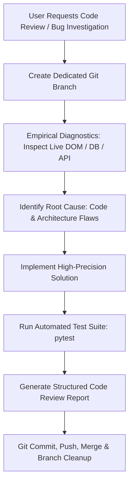

# Code Review & Root-Cause Engineering Methodology

This skill defines the standard procedure and reporting style for conducting code reviews, architectural audits, and debugging investigations in this repository.

---

## 🎯 Core Principles

1. **Root Cause Analysis (Never Settle for Surface Symptoms)**:
   - Identify the exact mechanisms causing defects (e.g. external API rate limits / fallback coordinates, query bleed across sessions, DOM parsing edge cases, async race conditions).
   - Trace data flow end-to-end: Scraper DOM Extraction $\rightarrow$ Normalization $\rightarrow$ Database Storage $\rightarrow$ API Route $\rightarrow$ Frontend UI / Charting.

2. **Empirical Verification (Test First, Don't Guess)**:
   - Run live diagnostic scripts to inspect real DOM trees, API outputs, or database states before and after changes.
   - Write and run automated tests (`pytest`) covering the exact edge cases discovered during the review.

3. **Strict Policy Compliance**:
   - **Language Policy**: All code, comments, docstrings, log messages, test names, and commit messages MUST be in **English**.
   - **Git Branching Policy**: Never commit directly to `main`. Always create a dedicated branch (`feature/`, `fix/`, `refactor/`), push to `origin`, and run full test suites before merging.

---

## 📋 Code Review Execution Workflow



### Step 1: Branch Creation
Always start by checking out a dedicated task branch:
```bash
git checkout -b fix/<issue-name>   # or feature/<feature-name>
```

### Step 2: Diagnostic Inspection & Evidence Gathering
- Run short diagnostic scripts against live components (e.g., Playwright page evaluations, database query analyzers, or Nominatim/API probes).
- Compare actual vs expected outputs and document why the existing implementation breaks down under edge cases.

### Step 3: High-Precision Implementation
- Implement permanent fixes rather than fragile heuristics (e.g., using offline high-precision datasets instead of rate-limited online geocoding, implementing relational junction tables instead of string-matched queries).
- Preserve existing documentation, type hints, and code comments.

### Step 4: Verification & Automated Testing
- Update or create test cases in `tests/` verifying the root-cause fix.
- Run the full test suite:
```bash
PYTHONPATH=. .venv/bin/pytest
```
Ensure all tests pass with 0 errors.

---

## 📝 Structured Code Review Report Template

When delivering the code review to the user, format the report with the following structure:

### 1. `🔍 0. Code Review: Diagnóstico de la Causa Raíz`
- Clearly explain the exact technical reasons why the problem occurred.
- Detail the flaws in data flow, logic, or external interactions.

### 2. `🚀 Solución Implementada / Propuesta`
- Itemize the architectural and code-level changes made to solve each problem systematically.
- Reference modified files and components.

### 3. `🧪 Verificación, Pruebas y Estado Actual`
- State test results (e.g. `33/33 tests passing`).
- Detail live environment status (e.g. database row counts, active dev server URL).
- Summarize Git actions performed (branch creation, commit, push, merge).
